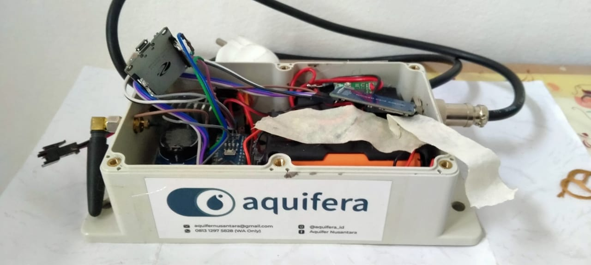
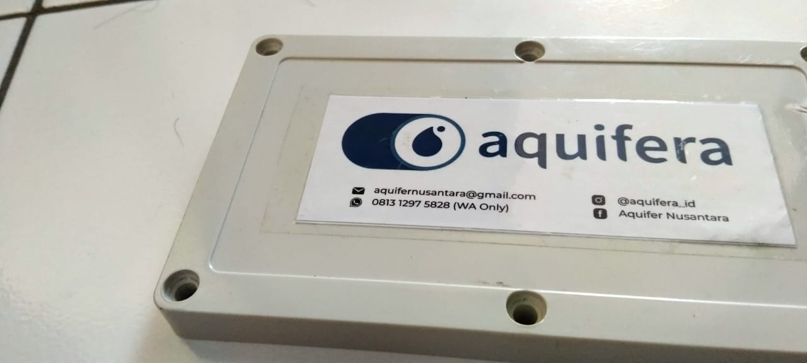
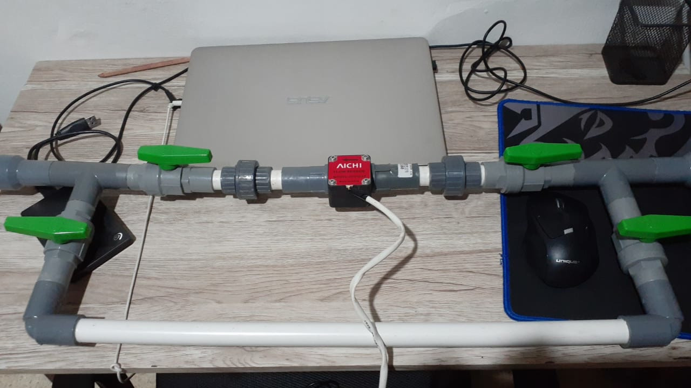

# Aquifera Waterbox

The official firmware for Aquifera Waterbox. Made to count the debit of water flow from Aquifera watersystems, then send the data through an ESP32 as internet gateway.

Arduino Nano using AICHI flow sensor connected to an ESP32 through UART.

In this version, currently uses a ESP32 connected through UART on Pin RX 6, Pin TX 5. The ESP32 runs the [esp32-mqtt-wifi](https://github.com/royyandzakiy/esp32-mqtt-wifi).

The current implemented hardware is still in a very rough first MVP version. There will be further developments by creating a proper PCB and housing.

## How To:
### Preparation:

- Install [VSCode](https://www.arduino.cc/en/main/software)
- Install Platform IO Extension
- Build!

---

### a note from Royyan

a :droplet: Aquifera Project

Use this as you wish! Happy making! :octocat: